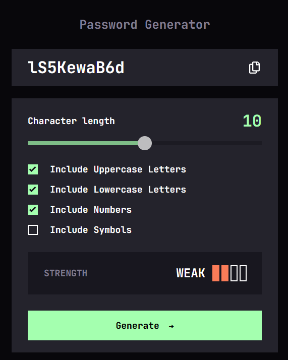
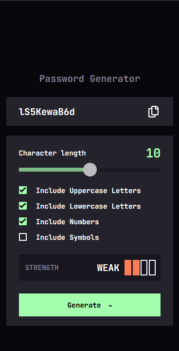

# Password Generator App

A very simple and responsive web app that generates a random password based on attributes requested by user. It then calculates a rating for the password based on the calculated entropy.

## Practice and reinforce:
- Responsive design
- DOM manipulation
- Clean and maintanable code
- Input form validations

## Technologies:
- HTML5
- CSS3
- Vanilla Javascript

## Main features:
-  Allows user to input:
    - Password Length
    - Password attributes: include lowercase, include uppercase, include numbers, include symbols (special characters)
- Displays:
    - A randon generated password
- Error handing for invalid requested attributes
- A button to copy to clipboard the generated password.
- Fully responsive for mobile, tablet and desktop

## How to use
1. Select a password length
2. Choose which attributes must the password contains
3. Generate the password
4. If you are satisfied with the rating, copy the generated password to the clipboard.

## **Desktop preview:**

## **Mobile preview:**

## Live site url:
https://cf-passwordgenerator.netlify.app/